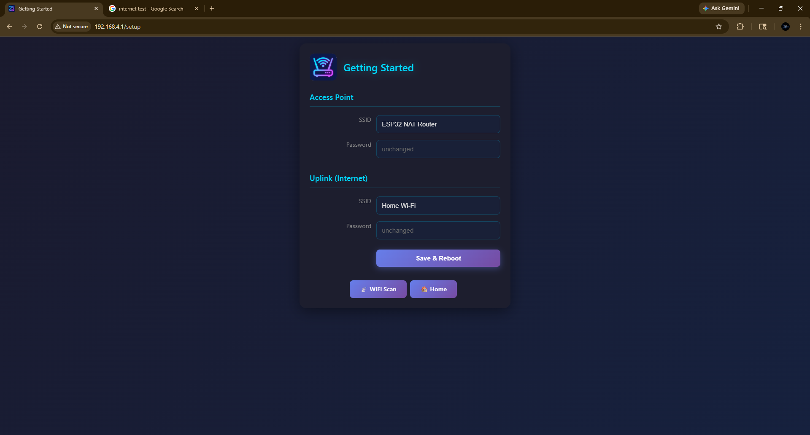
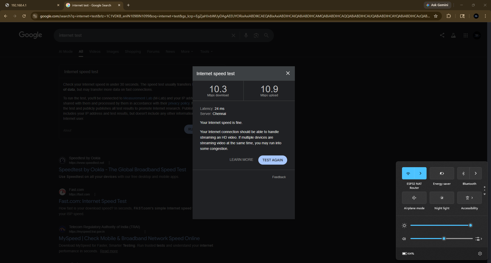

NAT Router (ESP32)

🚀 Project Overview

This project transforms a standard ESP32 microcontroller into a functional Network Address Translation (NAT) Router. It allows the device to connect to an upstream WiFi network (Station Mode) while simultaneously broadcasting its own secure WiFi network (Access Point Mode), effectively acting as a WiFi range extender or a "stealth" hotspot.

Why this project?

- ISP Bypass: Bypasses tethering restrictions from ISPs (like Airtel/Vi) by managing TTL (Time To Live) and DNS at the hardware level.
- Cost-Effective: Implements professional routing logic on a $5 chip.
- Custom UI: Features a modern, dark-themed Web Dashboard for real-time configuration.

🛠️ Technical Stack

Hardware: ESP32 (Dual-core Tensilica Xtensa® 32-bit LX6).
Framework: Arduino / ESP-IDF.
Core Logic: LwIP (Lightweight IP) stack with NAPT (Network Address Port Translation) enabled.
Frontend: HTML5, CSS3 (Neon-Dark Theme), JavaScript (Fetch API/AJAX).
Storage: LittleFS (Flash Filesystem) for UI assets and NVS (Non-Volatile Storage) for persistent credentials.

📡 Core Functionality

1. Simultaneous AP + STA Mode

The system utilizes the ESP32's dual-mode WiFi capability. The Station (STA) interface handles the "Uplink" (internet source), while the Soft Access Point (AP) interface creates a local gateway for clients.

2. LwIP NAPT Implementation

- At the heart of the project is the NAPT table. When a client sends a packet, the ESP32:
- Intercepts the packet.
- Rewrites the Source IP and Port in the packet header.
- Forwards the packet to the Uplink.
- Maps the returning response back to the correct client.

3. Dynamic Web Dashboard

- The UI is not just a static page; it's a dynamic interface that:
- Triggers real-time WiFi scans on the ESP32.
- Allows users to "Select & Connect" to nearby networks.
- Saves configurations to the chip's internal flash so they persist after reboot.

⚙️ Installation & Setup

Environment: Open the project in VS Code with the PlatformIO extension.
Filesystem: * Click the PlatformIO icon.

- Run Build Filesystem Image.
- Run Upload Filesystem Image (This flashes the data folder).

Firmware: Click Upload to flash the C++ logic.

Connect:

- Connect to the WiFi network: ESP32_NAT_Router.
- Open http://192.168.4.1 in your browser.

📊 Performance Metrics

- Throughput: Up to 15 Mbps (TCP/UDP).
- Client Capacity: Supports 3-5 simultaneous devices.
- Security: WPA2-PSK encryption on the Local Access Point.

